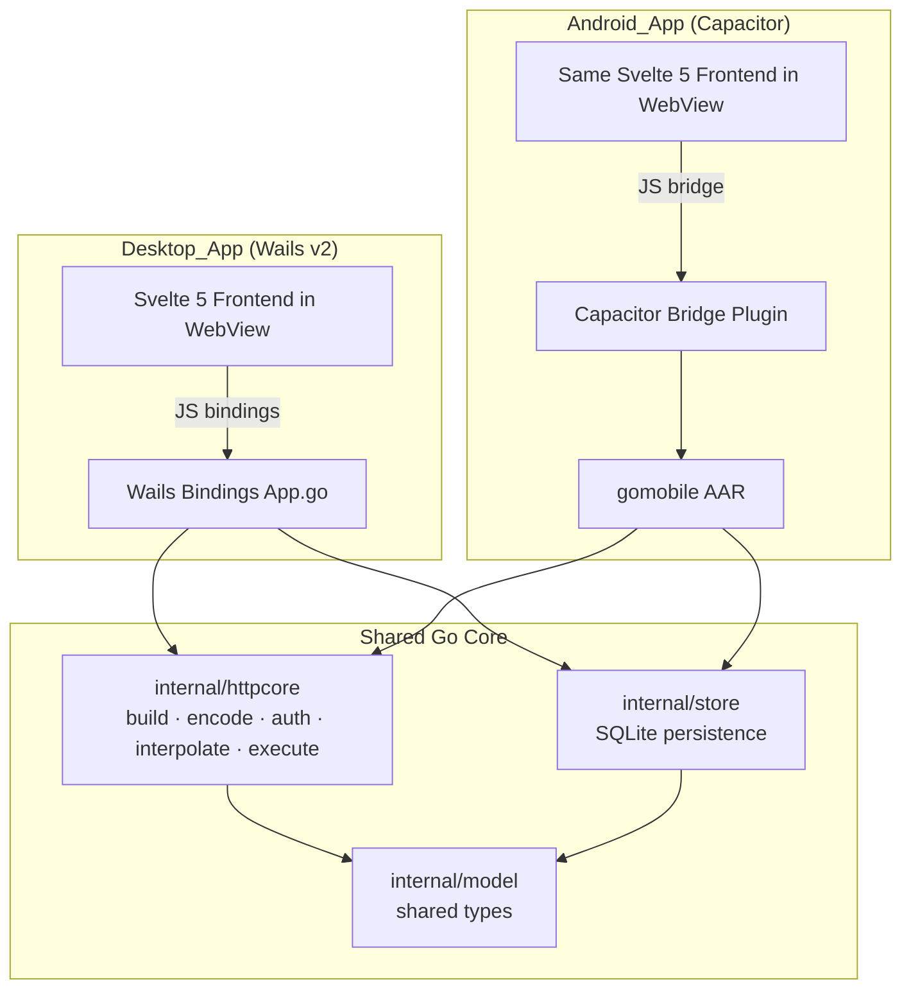
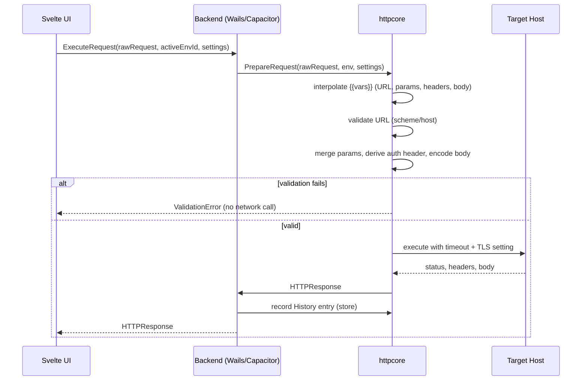
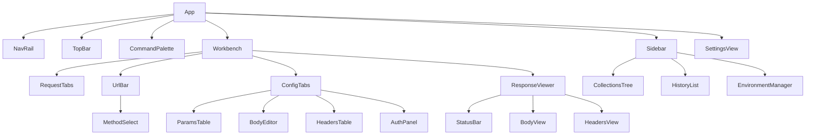

# Design Document

## Overview

Volt evolves from a single-screen Wails prototype into a complete, cross-platform API client with a desktop build (Windows, macOS, Linux), an Android build, automated CI/CD, persistent storage, and a professional, strictly square-cornered design system.

The central architectural decision driving this design is the extraction of all request-preparation and execution logic out of the current `httpclient.go` / `App.svelte` split and into a **single, pure Go core package (`internal/httpcore`)**. Today, request building is spread between the frontend (auth headers are assembled in `App.svelte`) and the backend (`ExecuteRequest` merges params and sets Content-Type). That split makes behavioral parity between desktop and Android impossible to guarantee and makes the logic hard to test. Consolidating everything — query-param merging, header handling, auth derivation, body encoding, variable interpolation, validation, and execution — into one deterministic Go package means:

- The **same compiled logic** runs on desktop (via Wails bindings) and Android (via a `gomobile` AAR), so a request behaves identically everywhere.
- The core becomes a set of **pure functions** with clear inputs and outputs, which is ideal for property-based testing of the encoding, auth, and interpolation rules that dominate Requirements 1–6.

The frontend keeps responsibility for what it does best — building the request interactively, rendering responses, and managing the UI — but delegates all "what bytes go on the wire" decisions to the core.

### Resolving the Android Open Technical Decision

The requirements explicitly defer *how* the Android app is produced to this design phase. Three candidate mechanisms were considered:

| Approach | Code reuse | Behavioral parity | Build complexity | Verdict |
|---|---|---|---|---|
| **Capacitor shell + Go core via `gomobile` AAR** | Full Svelte UI + full Go engine | High — identical engine binary logic | Medium | **Chosen** |
| Capacitor shell + native `CapacitorHttp` plugin (no Go) | Full Svelte UI, engine logic re-implemented in TS | Low — two engines to keep in sync | Low | Fallback only |
| Tauri v2 mobile | UI reusable, engine rewritten in Rust | Low — Go engine discarded | High | Rejected |

**Decision: the Android app reuses the exact Svelte frontend inside a [Capacitor](https://capacitorjs.com/docs/android) WebView shell, and calls the shared Go `httpcore` package compiled to an Android library (`.aar`) with [`gomobile bind`](https://pkg.go.dev/golang.org/x/mobile/cmd/gomobile) through a small custom Capacitor plugin.**

Rationale:
- Capacitor reliably wraps a Svelte/Vite web build into a native Android project and supports custom native plugins that bridge JavaScript to native code, so the entire Requirement 11/12 design system and responsive layout transfer to Android unchanged (satisfying Requirement 15.6).
- Running requests through native Go (not the WebView's `fetch`) means Android requests are not subject to browser CORS, satisfying Requirement 15.2 the same way the desktop app does.
- The same `httpcore` package powers both targets, so Requirements 15.1–15.4 are guaranteed to match desktop behavior rather than re-derived.
- `gomobile` is officially described as experimental, so the design isolates the mobile binding behind the same `Backend` interface the desktop uses (see Components). If `gomobile` integration becomes a blocker, the fallback is the `CapacitorHttp` native HTTP plugin; in that case the engine's pure logic (encoding, auth, interpolation) is shared as a TypeScript port generated from the same test vectors, preserving parity. This fallback is documented but not the primary path.

> Research note: gomobile is an experimental Go subproject for producing Android/iOS bindings; Capacitor is a maintained shell for hosting web UIs in a native Android WebView with a JS↔native bridge. Content was rephrased for compliance with licensing restrictions. Sources: [gomobile cmd docs](https://pkg.go.dev/golang.org/x/mobile/cmd/gomobile), [Capacitor Android docs](https://capacitorjs.com/docs/android), [Capacitor custom native code](https://capacitorjs.com/docs/android/custom-code).

### Goals

- One pure Go core shared by all platforms; no request logic in the frontend.
- Durable, Go-managed persistence replacing `localStorage` (with one-time migration of existing history).
- A token-driven design system with a hard 0px border-radius rule and a single spacing scale.
- A responsive layout spanning 320px to 3840px.
- Tag-driven GitHub Actions CI/CD producing versioned desktop and Android release artifacts.

### Non-Goals (this iteration)

- OAuth2 flows (Req 3.10), Postman/OpenAPI import (Req 8.8), and proxy support (Req 9.9) are marked Stretch and are designed for but not required to ship.
- iOS distribution (the core is structured to allow it later, but it is out of scope).

## Architecture



The frontend never talks to `httpcore` directly. It talks to a `Backend` abstraction (TypeScript interface). Two implementations exist: a Wails implementation (`wailsBackend`) and a Capacitor implementation (`capacitorBackend`). Both forward to the same Go core, so the UI code is identical across platforms.

### Request Execution Flow



### Layered Responsibilities

- **`internal/model`** — plain data structs (Request, Collection, Folder, Environment, Variable, HistoryEntry, Settings, KeyValue, BodySpec, AuthSpec) with JSON tags, shared by all layers.
- **`internal/httpcore`** — pure preparation + execution. No persistence, no UI concerns. Deterministic given inputs (the network call is the only side effect, isolated behind an injectable `Doer` so tests can mock it).
- **`internal/store`** — SQLite-backed persistence with schema migrations and the localStorage→store history migration. Pure-Go SQLite driver (`modernc.org/sqlite`, no cgo) so it links cleanly under `gomobile`.
- **Bindings** — `App` (Wails) and `mobile` (gomobile) expose store CRUD and `ExecuteRequest` to their respective shells.
- **Frontend** — Svelte 5 runes-based stores + components + design system.

## Components and Interfaces

### Go Core: `internal/httpcore`

```go
// PreparedRequest is the fully-resolved, ready-to-send request.
type PreparedRequest struct {
    Method      string
    URL         string        // interpolated, params merged, api-key-query applied
    Header      http.Header   // interpolated + auth applied
    Body        []byte        // encoded per BodySpec
    ContentType string        // "" means do not set
}

// PrepareRequest resolves variables, validates, and encodes a raw request.
// It performs NO network I/O. Returns a ValidationError when the URL is invalid.
func PrepareRequest(r model.Request, env model.Environment, s model.Settings) (PreparedRequest, error)

// InterpolateString replaces {{name}} tokens using env, returning the
// resolved string and the list of tokens that could not be resolved.
func InterpolateString(in string, env model.Environment) (out string, unresolved []string)

// EncodeBody encodes a BodySpec into bytes + content type per Requirement 2.
func EncodeBody(b model.BodySpec, method string) (body []byte, contentType string)

// DeriveAuthHeader returns the Authorization header value (or "") and any
// query key/value for API-Key-in-query, per Requirement 3.
func DeriveAuthHeader(a model.AuthSpec) (headerName, headerValue, queryKey, queryValue string)

// Execute sends a PreparedRequest using the injected Doer and returns the response.
func Execute(ctx context.Context, doer Doer, pr PreparedRequest, s model.Settings) model.HTTPResponse

// Doer is satisfied by *http.Client; mockable in tests.
type Doer interface{ Do(*http.Request) (*http.Response, error) }
```

Key behavioral rules implemented here (mapped to requirements):
- URL validation: empty / missing scheme / non-http(s) scheme / missing host → `ValidationError` naming the failed rule, no network call (Req 1.3).
- Param merge: enabled & non-empty rows percent-encoded into the query string; disabled rows excluded (Req 1.4, 1.5).
- Headers: enabled & non-empty rows set, multiple rows with the same name preserved via `Header.Add` (Req 1.6).
- Body encoding by type with Content-Type defaulting and user-override precedence; GET/HEAD always bodyless (Req 2.2–2.9).
- Auth derivation with whitespace-only guards and "auth wins over headers-table Authorization" precedence (Req 3.2–3.9).
- Interpolation across URL, params, headers, body; unresolved tokens sent literally (Req 6.4, 6.5, 6.8).
- Timeout from settings; TLS skip from settings (Req 9.3, 9.5).

### Go Core: `internal/store`

```go
type Store interface {
    // Collections / Folders / Requests
    SaveCollection(c model.Collection) (model.Collection, error)
    RenameCollection(id, name string) error
    DeleteCollection(id string) error
    SaveRequest(r model.Request, parentID string) (model.Request, error)
    MoveRequest(requestID, targetParentID string) error
    ListTree() ([]model.Collection, error)

    // Environments / Variables
    SaveEnvironment(e model.Environment) (model.Environment, error)
    DeleteEnvironment(id string) error
    SetActiveEnvironment(id string) error // "" clears active
    ListEnvironments() ([]model.Environment, error)

    // History
    AddHistory(h model.HistoryEntry) error // enforces 1000-entry cap
    ListHistory() ([]model.HistoryEntry, error)
    ClearHistory() error
    MigrateLegacyHistory(entries []model.HistoryEntry) (migrated bool, err error)

    // Settings
    GetSettings() (model.Settings, error)
    SaveSettings(model.Settings) error

    // Import / Export
    ExportCollection(id string) ([]byte, error)
    ExportEnvironment(id string) ([]byte, error)
    Import(data []byte) (ImportResult, error)
}
```

Persistence uses SQLite with tables `collections`, `folders`, `requests`, `environments`, `variables`, `history`, `settings`, and a `meta` table holding a `schema_version` and a `legacy_history_migrated` flag (Req 7.8 — migrate exactly once). Names are validated at this layer as a defense-in-depth backstop to the frontend checks (Req 5.8, 6.9). All write operations are transactional so a failed save leaves prior data intact (Req 5.9, 6.9, 8.5).

### Bindings

- **Wails (`app.go`)** — methods bound to the frontend: `ExecuteRequest`, `ListTree`, `SaveRequest`, `SaveCollection`, `RenameCollection`, `DeleteCollection`, `MoveRequest`, environment/history/settings/import-export methods, and `AppVersion()` returning the embedded `Semantic_Version` (Req 13.1). Version injected at build via `-ldflags "-X main.version=..."`.
- **Mobile (`mobile/bind.go`)** — a `gomobile`-friendly facade exposing string-in/string-out (JSON) methods, because `gomobile bind` supports a restricted type set. The Capacitor plugin marshals JS objects to JSON, calls the AAR, and returns JSON.

### Frontend: Backend Abstraction

```typescript
export interface Backend {
  executeRequest(req: RawRequest, activeEnvId: string | null, settings: Settings): Promise<HTTPResponse>
  listTree(): Promise<Collection[]>
  saveRequest(req: SavedRequest, parentId: string): Promise<SavedRequest>
  // ...collections, folders, environments, history, settings, import/export
  appVersion(): Promise<string>
}
// Selected at startup: wailsBackend (desktop) or capacitorBackend (android).
```

### Frontend: Component Tree



### Frontend: State Stores (Svelte 5 runes)

- `requestStore` — current editor request; bidirectional URL↔params sync (Req 1.7, 1.8).
- `collectionsStore`, `environmentsStore`, `historyStore`, `settingsStore` — mirror the Go store; all mutations go through the `Backend`.
- `uiStore` — active panels, breakpoint, command palette open state, theme.
- `interpolationStore` — derived; flags unresolved `{{tokens}}` for inline indication (Req 6.6).

### Command Palette & Shortcuts

A single global keydown handler registers commands in a registry `{id, name, run}`. Filtering is a case-insensitive substring match over `name` (Req 10.3). Shortcuts (Ctrl/Cmd+Enter send, Ctrl/Cmd+K palette, Ctrl/Cmd+S save) call `preventDefault()` (Req 10.1, 10.2, 10.5). Arrow keys move the highlight; Enter runs; Escape closes (Req 10.4, 10.8, 10.9).

## Data Models

```typescript
type Method = 'GET'|'POST'|'PUT'|'PATCH'|'DELETE'|'HEAD'|'OPTIONS'
type BodyType = 'none'|'json'|'text'|'form-data'|'urlencoded'
type AuthType = 'none'|'bearer'|'basic'|'apikey'
type ApiKeyLocation = 'header'|'query'

interface KeyValue { key: string; value: string; enabled: boolean }

interface BodySpec {
  type: BodyType
  raw: string                 // json/text content
  formFields: KeyValue[]      // form-data / urlencoded
}

interface AuthSpec {
  type: AuthType
  bearerToken: string
  basicUser: string
  basicPass: string
  apiKeyName: string
  apiKeyValue: string
  apiKeyLocation: ApiKeyLocation
}

interface RawRequest {
  method: Method
  url: string
  params: KeyValue[]
  headers: KeyValue[]
  body: BodySpec
  auth: AuthSpec
}

interface SavedRequest extends RawRequest { id: string; name: string }      // 1..255 chars
interface Folder { id: string; name: string; folders: Folder[]; requests: SavedRequest[] } // ≤10 deep
interface Collection { id: string; name: string; folders: Folder[]; requests: SavedRequest[]; order: number }

interface Variable { name: string; value: string }   // name 1..128 unique; value 0..4096
interface Environment { id: string; name: string; variables: Variable[]; active: boolean } // name 1..64 unique

interface HistoryEntry {
  id: string; method: Method; url: string
  status: number; durationMs: number; at: number
  error: string                 // "" on success
  request: RawRequest           // full config for restore
}

interface Settings {
  theme: 'light'|'dark'|'system'   // default system
  tlsVerify: boolean               // default true
  timeoutSeconds: number           // 1..600, default 30
  proxyUrl: string                 // stretch
}

interface HTTPResponse {
  status: number; statusText: string; headers: KeyValue[]
  body: string; durationMs: number; sizeBytes: number; error: string
  truncated: boolean               // true when body > 5 MB (Req 4.11)
}
```

The existing Go `KeyValue`, `HTTPRequest`, and `HTTPResponse` structs are extended (not replaced): `HTTPRequest` gains `Body BodySpec`, `Auth AuthSpec`, and the engine receives the active environment and settings. `HTTPResponse` gains `Truncated bool`. The current flat `RequestState` in `types.ts` is superseded by `RawRequest` with structured `body`/`auth`.

### Export Format

```json
{
  "voltFormat": "collection",
  "version": 1,
  "exportedAt": "<RFC3339>",
  "collection": { /* Collection with nested folders/requests */ }
}
```

Environment export uses `"voltFormat": "environment"`. Import validates `voltFormat` + `version` against supported schemas and rejects the whole file on any mismatch or malformed JSON, leaving existing data untouched (Req 8.5). Name collisions create new entries (Req 8.6).

## Correctness Properties

*A property is a characteristic or behavior that should hold true across all valid executions of a system — essentially, a formal statement about what the system should do. Properties serve as the bridge between human-readable specifications and machine-verifiable correctness guarantees.*

The properties below are derived from the prework analysis. Redundant criteria were consolidated: the many body-encoding criteria collapse into one encoding property, the auth criteria into one derivation property, the persistence-retention criteria into one round-trip property, and so on. Criteria classified as EXAMPLE, EDGE_CASE, INTEGRATION, or SMOKE are covered by the Testing Strategy rather than as properties.

### Property 1: Request assembly includes enabled rows, excludes disabled rows, and preserves method and duplicate header names

*For any* raw request, the prepared request's method equals the input method, every enabled non-empty query parameter appears percent-encoded in the final URL query, every enabled non-empty header is set (with all rows sharing a header name preserved), and no disabled or empty-key row appears in either the query or the headers.

**Validates: Requirements 1.2, 1.4, 1.5, 1.6**

### Property 2: URL and parameter table round-trip

*For any* set of enabled, non-empty query parameters, encoding them into the raw URL query string and then parsing that query string back into a parameter table yields a parameter table equivalent to the original enabled parameters.

**Validates: Requirements 1.7, 1.8**

### Property 3: Invalid URLs are rejected without a network call

*For any* URL that is empty, omits a scheme, uses a scheme other than http or https, or omits a host, `PrepareRequest` returns a validation error identifying the failed rule and the injected network `Doer` is never invoked.

**Validates: Requirements 1.3**

### Property 4: Body encoding and Content-Type rules

*For any* request, the encoded body and Content-Type satisfy: None yields no body and no Content-Type; Raw JSON and Plain Text yield the raw content with a default Content-Type of `application/json` and `text/plain` respectively unless the user set a Content-Type, in which case the user value is used; and when the method is GET or HEAD the body is empty regardless of body type.

**Validates: Requirements 2.2, 2.3, 2.4, 2.5, 2.9**

### Property 5: Form body round-trip excludes disabled and empty-key rows

*For any* set of form fields, encoding them as `x-www-form-urlencoded` (or as `multipart/form-data`) and then decoding the produced body yields exactly the enabled, non-empty-key fields, and the Content-Type is the corresponding form media type (including the generated boundary for multipart).

**Validates: Requirements 2.6, 2.7, 2.8**

### Property 6: JSON formatting preserves value or leaves invalid input unchanged

*For any* string, if it is valid JSON then Prettify produces output that parses to an equal JSON value and is indented with two spaces; if it is not valid JSON then Prettify leaves the content unchanged and reports an invalid-JSON indication. (The response Pretty view uses the same function and therefore shares this property.)

**Validates: Requirements 2.10, 2.11, 4.4, 4.5**

### Property 7: Authorization derivation across all types with header precedence

*For any* authorization configuration: Bearer with a non-whitespace token yields `Authorization: Bearer <token>` and Bearer with empty/whitespace yields no header; Basic with a non-whitespace username yields `Authorization: Basic <base64(user:pass)>` whose decoded value equals `user:pass` (missing password treated as empty); API Key in Header with a non-whitespace name yields that request header; API Key in Query with a non-whitespace name appends exactly one name-value pair to the query; an empty/whitespace API key name and the None type add nothing; and whenever the active authorization produces an `Authorization` header it overrides any `Authorization` row from the headers table.

**Validates: Requirements 3.2, 3.3, 3.4, 3.5, 3.6, 3.7, 3.8, 3.9**

### Property 8: Variable interpolation resolves defined tokens and passes unresolved tokens through literally

*For any* field text (URL, parameter, header, or body) and active environment, every `{{name}}` token matching a Variable name case-sensitively is replaced by that Variable's value, every token with no case-sensitive match (or when no environment is active) is reported as unresolved and is sent unchanged, and the request still executes.

**Validates: Requirements 6.4, 6.5, 6.6, 6.8**

### Property 9: Response status color matches its status class

*For any* status code in the range 100 to 599, the color selected by the response viewer corresponds to the code's class: one color for 2xx, one for 3xx, one for 4xx, and one for 5xx.

**Validates: Requirements 4.2**

### Property 10: Response headers preserve received order

*For any* list of response headers returned by the engine, the response viewer displays them as name-value pairs in the same order they were received.

**Validates: Requirements 4.8**

### Property 11: Large response bodies are truncated at the 5 MB boundary

*For any* response body, the viewer marks the body truncated and displays exactly the first 5,242,880 bytes (offering a control to view or save the full body) if and only if the body exceeds 5,242,880 bytes; otherwise the full body is displayed untruncated.

**Validates: Requirements 4.11**

### Property 12: Persistence round-trip across reopen

*For any* persisted entity set (collection tree with folders and requests, environments with variables, history, or settings), saving it and then reopening the store yields data structurally equal to the original, including names, nesting structure, and order.

**Validates: Requirements 5.1, 5.5, 5.6, 6.7, 7.5, 9.7, 15.5**

### Property 13: Moving a request leaves it in exactly one location

*For any* collection tree and any contained request, moving that request into a target collection or folder results in the request appearing exactly once in the target and not appearing in its prior location, while all other requests remain unchanged.

**Validates: Requirements 5.4**

### Property 14: Folder nesting depth is bounded at 10

*For any* attempted folder creation, the creation succeeds if and only if the resulting nesting depth is at most 10 levels.

**Validates: Requirements 5.3**

### Property 15: Name validation by length and uniqueness

*For any* candidate name, a Collection/Request name is accepted if and only if its length is between 1 and 255, an Environment name is accepted if and only if its length is between 1 and 64 and unique among Environments, and a Variable name is accepted if and only if its length is between 1 and 128 and unique within its Environment (with Variable values accepted for lengths 0 to 4096); rejected names leave existing data unchanged.

**Validates: Requirements 5.8, 6.1, 6.2, 6.9**

### Property 16: Exactly one (or zero) active environment

*For any* sequence of environment activations and deletions, at most one Environment is active at a time, and deleting the active Environment results in no active Environment.

**Validates: Requirements 6.3, 6.10**

### Property 17: History records complete entries in reverse chronological order and restores configuration

*For any* sequence of executed requests, each successful execution records a History entry containing method, URL, status, elapsed time, timestamp, and the full request configuration, each failed execution records an entry containing method, URL, error indication, timestamp, and the full configuration, the entries are presented in reverse chronological order, and selecting an entry restores a request configuration equal to the one recorded.

**Validates: Requirements 7.1, 7.2, 7.3, 7.4**

### Property 18: History is capped at 1000 entries discarding the oldest

*For any* number of recorded History entries, after recording, no more than 1000 entries are retained and the retained entries are the most recent ones.

**Validates: Requirements 7.6**

### Property 19: Legacy history migration is idempotent

*For any* set of legacy localStorage history entries, running the migration once imports them and marks migration complete, and running it again performs no further import (the migrated history is unchanged).

**Validates: Requirements 7.8**

### Property 20: Import/export round-trip with collision-safe naming

*For any* Collection or Environment, exporting it and then importing the exported file recreates an entry whose field values and nesting structure are identical to those present at export time (modulo newly assigned identifiers), and when the imported name matches an existing entry the existing entry is left unchanged and the import is added as a separate new entry.

**Validates: Requirements 8.1, 8.2, 8.3, 8.4, 8.6**

### Property 21: Malformed or unsupported imports are rejected atomically

*For any* input that is not valid JSON, is structurally malformed, or carries a format-version identifier not matching a supported schema, the import is rejected in full, all existing Collections, Environments, and Variables are left unchanged, and an error indicating the reason is reported.

**Validates: Requirements 8.5**

### Property 22: Timeout value validation

*For any* integer timeout value, the value is accepted if and only if it is between 1 and 600 seconds inclusive; a rejected value leaves the previous timeout in place.

**Validates: Requirements 9.6**

### Property 23: Command palette substring filtering

*For any* set of commands and any query string, the palette displays exactly the commands whose displayed name contains the query as a case-insensitive substring, and displays all commands when the query is empty.

**Validates: Requirements 10.3, 10.7**

### Property 24: Semantic version tag matching gates releases

*For any* pushed tag string, a release build is triggered if and only if the tag matches the `MAJOR.MINOR.PATCH` semantic-version format.

**Validates: Requirements 13.6**

## Error Handling

Errors are handled at the layer that owns the failure and surfaced through typed results, never silent failures.

### Core (`httpcore`)
- **Validation errors** (`ValidationError`) carry the failed rule name and are returned *before* any network call (Req 1.3). The frontend renders the rule-specific message.
- **Network/transport errors** (DNS, connection refused, TLS) are captured into `HTTPResponse.Error`; `Status`, `DurationMs`, and `SizeBytes` are left at zero so the viewer shows only the error (Req 4.9, 15.4).
- **Timeouts** use a `context.WithTimeout` derived from `Settings.timeoutSeconds`; a deadline exceedance yields a distinct timeout error indication (Req 9.5).
- **Body read errors** return the status already received plus an error describing the read failure.

### Store (`store`)
- All mutations run in a transaction; on failure the transaction rolls back so prior data is preserved, and a typed error is returned for the frontend to display (Req 5.9, 6.9).
- **Import** is validated and applied in a single transaction: any schema/JSON/version error aborts the whole import with no partial writes (Req 8.5).
- **Export** writes to a temp file and atomically renames on success; if the destination is unwritable it aborts before creating any file (Req 8.7).
- **History migration** failure preserves the legacy data and returns an error; the `legacy_history_migrated` flag is only set on success, so a later launch can retry (Req 7.9).

### Frontend
- Every control-triggered operation is wrapped so a failure shows an error indication and preserves the user's current input (Req 11.7).
- Unresolved `{{tokens}}` are shown with an inline unresolved indication but never block execution (Req 6.6, 6.8).
- TLS-verification-disabled state shows a persistent warning banner (Req 9.4).

### CI/CD
- Any failing build, type-check, or test step fails the run with the step identified, and no release or artifact is published for that run (Req 13.5, 14.4); Android publish is gated independently (Req 15.8).
- Non-semver tags are filtered by the workflow trigger so no release build starts (Req 13.6).

## Testing Strategy

A dual approach: property-based tests verify the universal rules of the pure core; unit, component, integration, smoke, and static-audit tests cover concrete behaviors, UI, infrastructure, and design-system constraints.

### Property-Based Testing

PBT is applicable because the core (`internal/httpcore`, `internal/store` logic, and several frontend pure helpers) consists of deterministic functions over large input spaces (requests, params, headers, bodies, auth configs, variable maps, JSON strings, names, command sets, tag strings).

- **Go core**: use [`testing/quick`](https://pkg.go.dev/testing/quick) or [`gopter`](https://github.com/leanovate/gopter) for Properties 1, 3, 4, 5, 7, 8, 12–22, 24. Network is mocked via the injectable `Doer`; the store runs against an in-memory SQLite database.
- **Frontend pure helpers**: use [`fast-check`](https://github.com/dubzzz/fast-check) with Vitest for Properties 2, 6, 9, 10, 11, 23 (URL↔param sync, JSON formatting, status color, header order, truncation, palette filter).
- Each property test runs a **minimum of 100 iterations**.
- Each property test is tagged with a comment referencing its design property, in the format: **Feature: volt-api-client, Property {number}: {property_text}**.
- Each correctness property is implemented by a **single** property-based test.

### Unit and Component Tests (EXAMPLE / EDGE_CASE criteria)
- Method list and defaults (1.1), body-type and auth-type enumerations and defaults (2.1, 3.1), settings defaults and range UI (9.1, 9.8).
- Response viewer rendering: field display (4.1), view toggle (4.3), HTML preview (4.6), non-previewable plain text (4.7), error rendering (4.9), loading indicator (4.10), copy-to-clipboard with mocked clipboard (4.12).
- Collections/history confirmation branches (5.7, 7.7), failing-store error path (5.9, 7.9).
- TLS toggle behavior and warning (9.3, 9.4), timeout abort with a slow mock `Doer` (9.5).
- Keyboard shortcuts with `preventDefault` (10.1, 10.2, 10.5), palette select/escape/arrow navigation and no-results (10.4, 10.7, 10.8, 10.9), shortcut listing (10.6).
- Theme application (9.2), control failure handling (11.7).
- Folder nesting depth (5.3) is also exercised with EDGE_CASE generators around the depth-10 boundary.

### Static Design-System Audits (Requirement 11)
- An automated audit asserts **no non-zero `border-radius`** anywhere in the built CSS and computed component styles (11.1).
- Lint/test asserting all spacing values are members of the defined spacing scale and container padding is ≥16px (11.2, 11.3).
- Lint/test forbidding hardcoded color/typography literals outside the token files (11.4).
- An E2E smoke pass confirms every advertised feature is reachable and operational with no placeholder or permanently disabled controls (11.5).

### Responsive Layout Tests (Requirement 12)
- Render at representative widths (320, 599, 600, 1023, 1024, 3840px) asserting the expected regions/sheets/tab presentation and that no interactive control overflows the viewport (12.1–12.4, 12.6); resize tests assert reflow and continued reachability (12.5).

### Integration and Smoke Tests (Infrastructure / CI / Android)
- **CI workflow** (`.github/workflows/ci.yml`): on push/PR, build Go + frontend, run both test suites, run `svelte-check` treating type errors as failures, report per-step status (14.1–14.5).
- **Release workflow** (`.github/workflows/release.yml`): triggered only by semver tags; builds desktop artifacts for Windows/macOS/Linux (via `wails build`) and the Android artifact (Capacitor build of the `gomobile` AAR), names artifacts with the version, publishes a single GitHub Release with notes, and gates Android publish independently (13.2–13.5, 15.7, 15.8). A failing step blocks the release.
- **Version smoke**: builds inject the version via `-ldflags`/Capacitor config; tests assert `AppVersion()` and the About view show it (13.1, 15.9).
- **Android instrumented tests**: send each HTTP method through the Capacitor↔AAR bridge and confirm execution against a no-CORS endpoint and an error endpoint (15.1, 15.2, 15.4); response display and design-system audits reuse the shared frontend tests (15.3, 15.6).

### Stretch Items
OAuth2 (3.10), Postman/OpenAPI import (8.8), and proxy (9.9) have integration/example test plans that activate only if the features are implemented; they are not required for the release.
